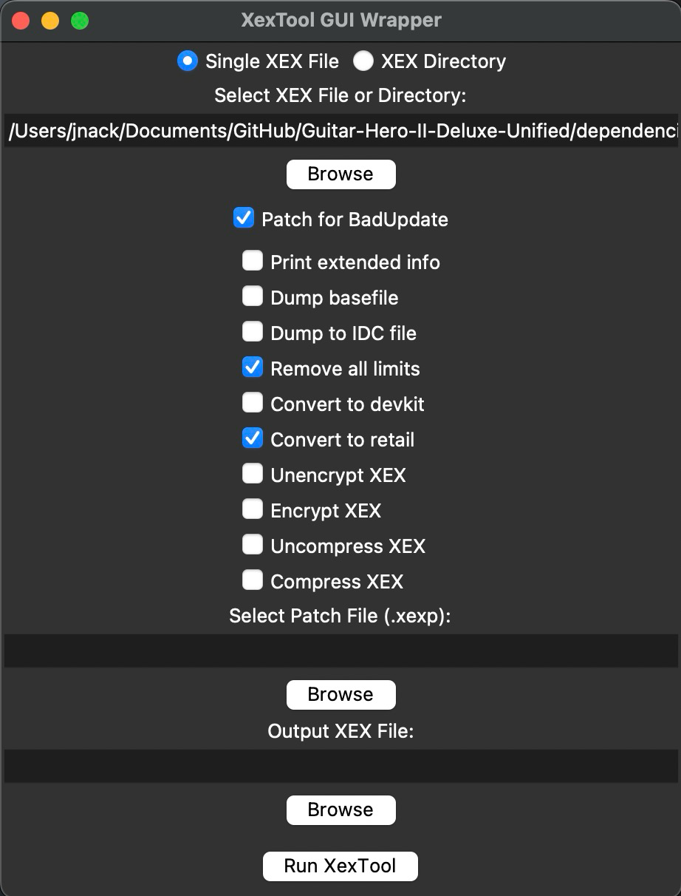

# xextoolgui
 crappy gui wrapper for xextool, written by ai

# Usage

* Download [xextool](https://digiex.net/threads/xextool-6-3-download.9523/)
* Place `xextool.exe` next to `xextoolgui.py`
* Open a terminal window in the location containing the script
* `python xextoolgui.py`

# Features

* Single file, or directory mode for batch operations
* `Patch for BadUpdate` preset for correct retail flags applied automatically
* .xexp patching via selection or automatically. just place `default.xexp` next to `default.xex` in directory mode
* auto backs up original .xex files to .xex_backup when in batch mode

# About

* This is very basic, intended just to make things a little less tedious
* XexTool will output information to the cmd window (ex. print extended info)

# Dependencies

* Python
* CrossOver (MacOS)
* Wine (Linux)